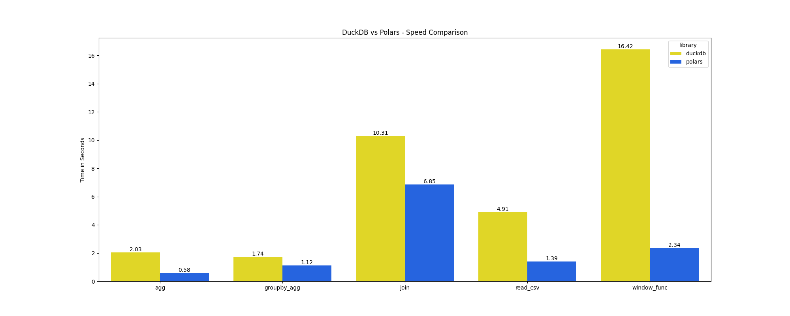

# DuckDB vs Polars
Unofficial Benchmarking on Performance Difference Between DuckDB and Polars.
Here's [the link to a blog post](https://medium.com/@yukithejapanese/duckdb-vs-polars-which-one-is-faster-61e73a7680e0) of this benchmark.

## Data
[2021 Yellow Taxi Trip](https://data.cityofnewyork.us/Transportation/2021-Yellow-Taxi-Trip-Data/m6nq-qud6/about_data) that contains 30M rows with 18 columns. It's about 3GB in size on disk. 

## Method
Using the following operations for the benchmark:
- Reading a csv file
- Simple aggregations (sum, mean, min, max)
- Groupby aggregations
- Window functions
- Joins

## Result 
I did the benchmark on an `Apple M1 MAX MacBook Pro 2021` with `64GB RAM`, `1TB SSD`, and `10‑Core CPU`.
\
\


## How to Run This Benchmark on Your Own
1. Download the csv file at: [2021 Yellow Taxi Trip](https://data.cityofnewyork.us/Transportation/2021-Yellow-Taxi-Trip-Data/m6nq-qud6/about_data).
2. Create `data` folder at the top level in the repo and place the csv file in the folder. The path the the file should be: `data/2021_Yellow_Taxi_Trip_Data.csv`. If you name it differently then you'll need to adjust the file path in the Python script(s).
3. Make sure you're in the virtual environment. 
```bash
python -m venv env
source env/bin/activate
```
4. Install dependencies.
```bash
pip install -r requirements.txt
```
Or
```bash
pip install duckdb polars pyarrow pytest seaborn
```
5. Run the benchmark.
```bash
python duckdb_vs_polars
```
6. Optional: Run the following command in terminal to run unit tests. 
```bash
pytest
```

## Notes/Limitations
- All the queries used for the benchmark are created by Yuki (repo owner). If you think they can be improved or want to add other queries for the benchmark, please feel free to make your own or make a pull request. 
- Benchmarking DuckDB queries is tricky because result collecting methods such as `.arrow()`, `.pl()`, `.df()`, and `.fetchall()` in DuckDB can make sure the full query gets executed, but it also dilutes the benchmark because then non-core systems are being mixed in.
    - `.arrow()` is used to materialize the query results for the benchmark. It was the fastest out of `.arrow()`, `.pl()`, `.df()`, and `.fetchall()` (in the order of speed for the benchmark queries). 
    - You could argue that you could use `.execute()`, but it might not properly reflect the full execution time because the final pipeline won't get executed until a result collecting method is called. Refer to [the discussion on DuckDB discord](https://discord.com/channels/909674491309850675/921100786098901042/1217841718066413648) on this topic.
    - Polars has the `.collect()` method that materializes a full dataframe.

## Future Plans for This Benchmark
Although, I don't have solid plans on how I want this repo to be, I plan on periodically run this benchmark as tools improve and get updates quickly. And potentially adding more queries to the benchmark down the road. 